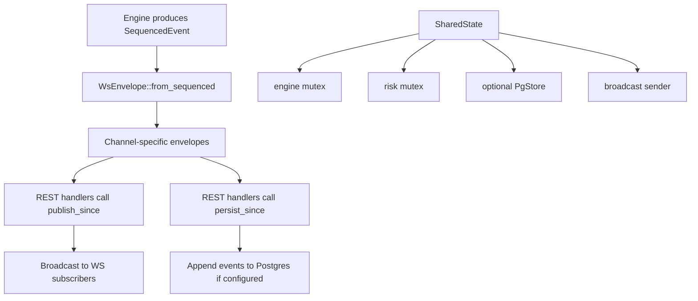

# `src/api/mod.rs` Flow

## Why this file exists

`api/mod.rs` is the shared root of the `api` module.

It provides the common state and event plumbing used by both:

- `src/api/rest.rs`
- `src/api/ws.rs`

## Block Flow

## Type / function guide

### `BROADCAST_CAPACITY`

What it does:

- sets the ring-buffer capacity for the broadcast channel

Why we need it:

- it controls how much lag a slow WebSocket client can tolerate before disconnect

### `WsEnvelope`

What it does:

- converts internal sequenced engine events into normalized WebSocket-ready event messages
- fans one engine event out to one or more logical channels

Why we need it:

- REST handlers should not know WebSocket channel formatting details
- clients need a stable outbound event shape

### `WsEnvelope::from_sequenced(se)`

What it does:

- maps a `SequencedEvent` to one or more outward-facing channel envelopes

Why we need it:

- a single engine event may need to be seen by multiple subscribers
- example: a fill goes to market trade stream and private trader streams

### `SharedState`

What it does:

- stores all shared runtime objects needed by handlers

Fields:

- `engine`: exclusive mutable access to the matching engine
- `risk`: exclusive mutable access to risk tracking state
- `pg`: optional Postgres store
- `events`: broadcast sender for live WebSocket fanout

Why we need it:

- Axum handlers and socket tasks need one shared source of truth

### `new(engine)`, `with_risk(...)`, `with_pg(...)`

What they do:

- construct `AppState = Arc<SharedState>`

Why we need them:

- one place to create app state with the right combinations of dependencies

### `publish_since(seq_before)`

What it does:

- finds engine events appended after `seq_before`
- converts them to `WsEnvelope`
- sends them through the broadcast channel

Why we need it:

- REST writes should immediately appear on live WebSocket streams

### `persist_since(seq_before)`

What it does:

- snapshots newly added sequenced events
- appends them to Postgres if `pg` is configured

Why we need it:

- crash recovery and state restoration depend on persisted event history
