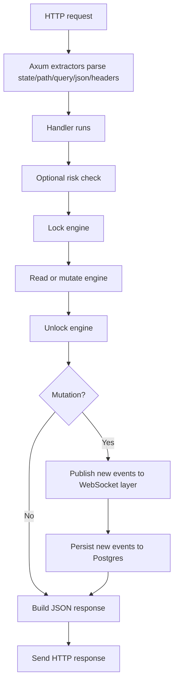
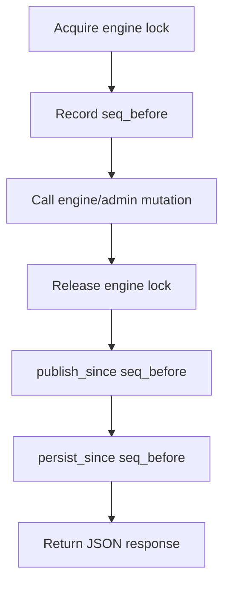
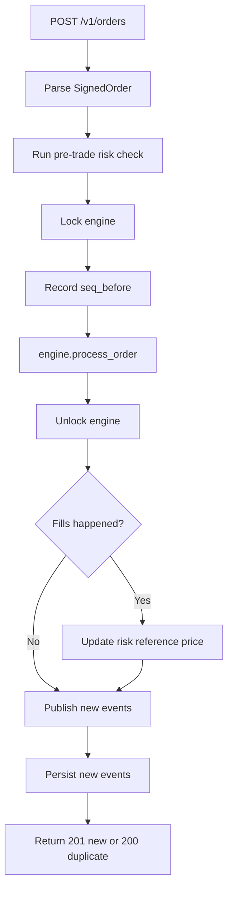
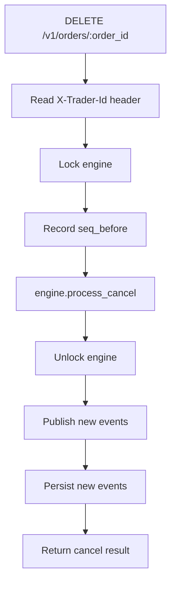
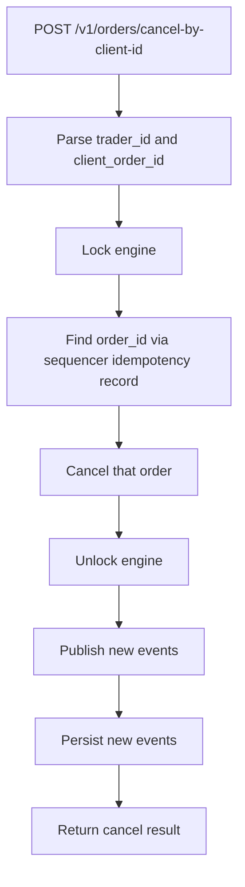

# `src/api/rest.rs` Flow

## Why this file exists

`rest.rs` is the HTTP request/response layer.

It does not implement matching itself. It translates HTTP requests into engine/admin/risk calls and translates internal results back into HTTP responses.

## High-level block flow

## Shared design pattern for mutating handlers

Why this pattern exists:

- engine mutations must be serialized
- publishing and persistence should happen after mutation succeeds
- slow I/O should not hold the engine lock longer than necessary

## Function guide

### `ApiError`

What it does:

- standard JSON error payload with `{ code, message }`

Why we need it:

- clients should not have to guess error response shape

### `ErrorResponse`

What it does:

- pairs an HTTP status with `ApiError`

Why we need it:

- lets handlers return domain failures as proper HTTP responses

### `engine_err_to_response(...)`

What it does:

- converts engine/domain errors into HTTP statuses and stable API error codes

Why we need it:

- the engine should not know about HTTP

### `risk_err_to_response(...)`

What it does:

- maps risk-layer failures to API responses

Why we need it:

- pre-trade checks fail before order processing, but clients still need consistent HTTP semantics

### `admin_err_to_response(...)`

What it does:

- maps admin operation failures to API responses

Why we need it:

- admin flows have different failure conditions from normal order flow

### `post_order(...)`

Block flow:

Why we need it:

- this is the main order-entry endpoint

### `delete_order(...)`

Block flow:

Why we need it:

- cancel by server-assigned `order_id`

### `cancel_by_client_id(...)`

Block flow:

Why we need it:

- clients often track their own client order IDs more easily than server order IDs

### `get_order(...)`

What it does:

- returns current state of a single order

Why we need it:

- direct lookup by order ID

### `get_book(...)`

What it does:

- returns an L2 order book snapshot for a market
- `depth` means how many price levels per side to return

Why we need it:

- clients need a fast snapshot API, especially for initial UI/bootstrap state

### `get_trades(...)`

What it does:

- returns fills from the event log, filtered by market and optional `from_seq`

Why we need it:

- clients need historical trade lookup and replay support

### `list_markets(...)`

What it does:

- returns market metadata and status

Why we need it:

- clients need to discover market config such as tick size and lot size

### `admin_pause_market(...)`

What it does:

- pauses trading for a market

Why we need it:

- operational control

### `admin_resume_market(...)`

What it does:

- resumes trading for a market

Why we need it:

- operational control

### `admin_cancel_all(...)`

What it does:

- cancels all open orders in a market

Why we need it:

- operational control during incidents or halts

### `build_router(state)`

What it does:

- wires all REST endpoints into the Axum router

Why we need it:

- a single place to see and maintain the REST surface
