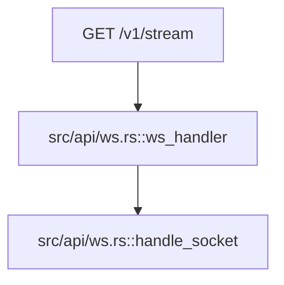
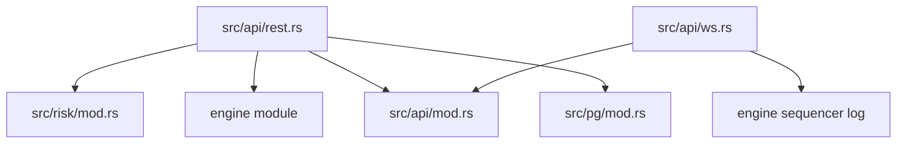

# API Routing Map

This is the shortest possible "where does a request go?" map.

## HTTP Entry

```mermaid
flowchart TD
    A[Client Request] --> B[src/main.rs]
    B --> C[build_router(state)]
    B --> D[build_ws_router(state)]
    C --> E[Axum route match]
    D --> E
    E --> F[src/api/rest.rs handler]
    E --> G[src/api/ws.rs handler]
```

## REST Endpoints

```mermaid
flowchart TD
    A[POST /v1/orders] --> A1[src/api/rest.rs::post_order]
    B[DELETE /v1/orders/:order_id] --> B1[src/api/rest.rs::delete_order]
    C[POST /v1/orders/cancel-by-client-id] --> C1[src/api/rest.rs::cancel_by_client_id]
    D[GET /v1/orders/:order_id] --> D1[src/api/rest.rs::get_order]
    E[GET /v1/books/:market_id?depth=N] --> E1[src/api/rest.rs::get_book]
    F[GET /v1/trades/:market_id?limit=N&from_seq=N] --> F1[src/api/rest.rs::get_trades]
    G[GET /v1/markets] --> G1[src/api/rest.rs::list_markets]
    H[POST /v1/admin/markets/:market_id/pause] --> H1[src/api/rest.rs::admin_pause_market]
    I[POST /v1/admin/markets/:market_id/resume] --> I1[src/api/rest.rs::admin_resume_market]
    J[POST /v1/admin/markets/:market_id/cancel-all] --> J1[src/api/rest.rs::admin_cancel_all]
```



## WebSocket Endpoint



## Common Downstream Dependencies


