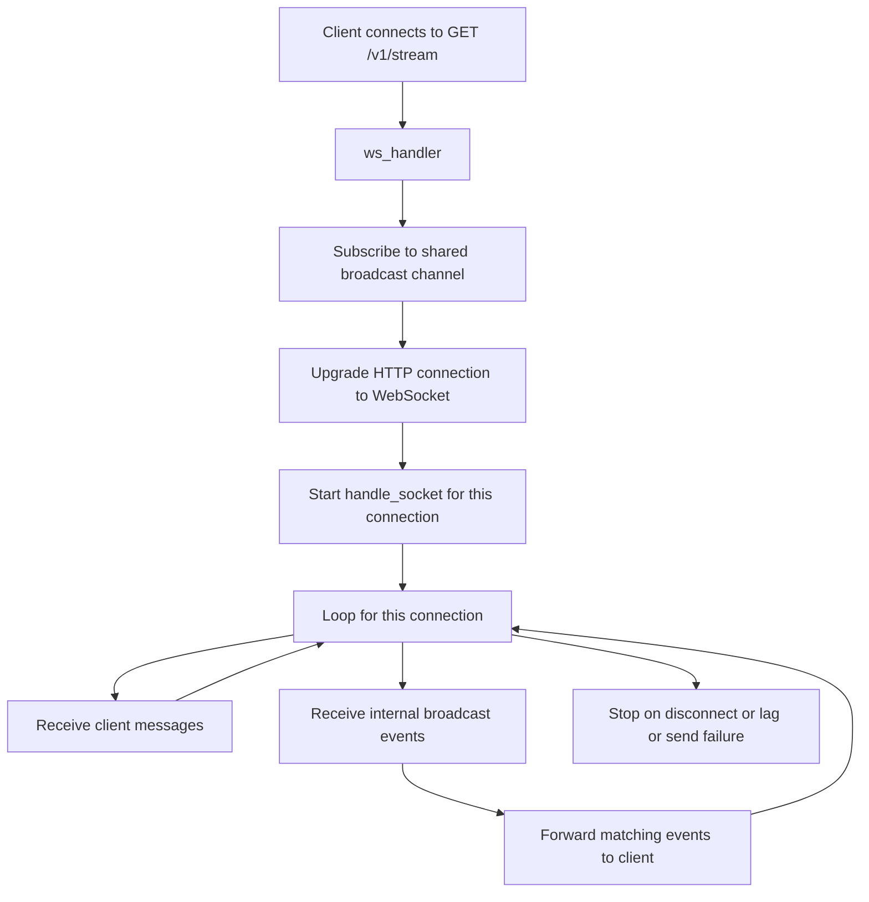
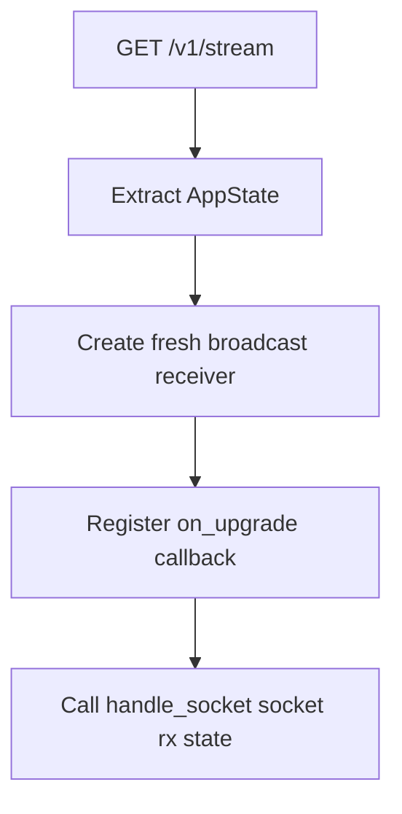
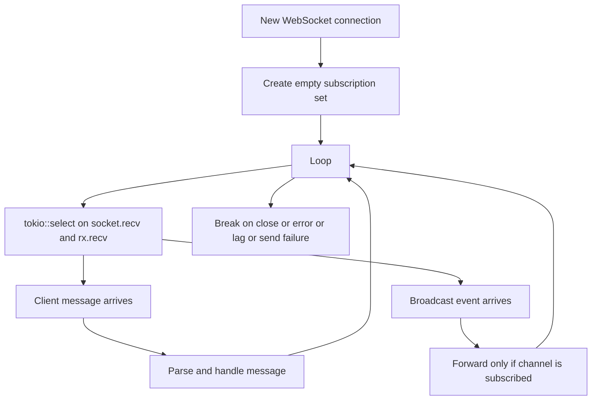
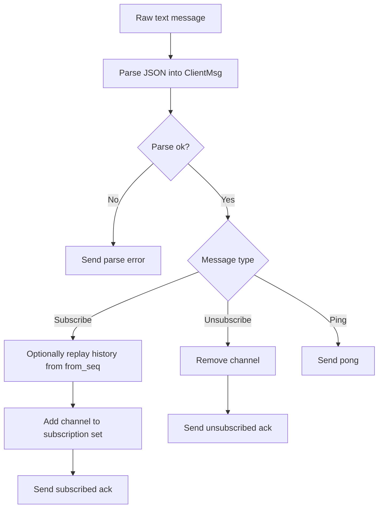
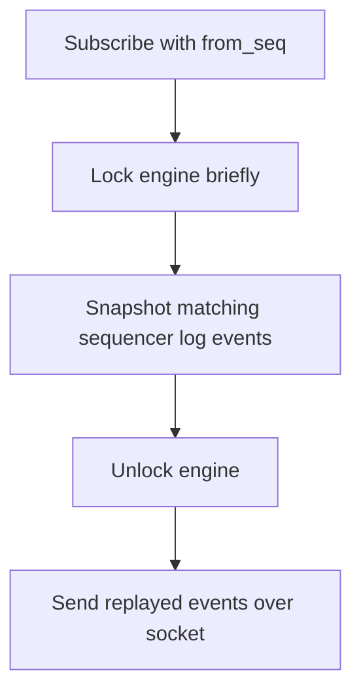

# `src/api/ws.rs` Flow

## Why this file exists

`ws.rs` is the realtime streaming side of the API.

It upgrades HTTP connections to WebSockets, lets each client subscribe to channels, and forwards matching events from the shared broadcast stream.

## High-level block flow

## Function guide

### `ClientMsg`

What it does:

- describes messages the client can send:
  - subscribe
  - unsubscribe
  - ping

Why we need it:

- the server needs a typed contract for incoming WebSocket control messages

### `ServerMsg`

What it does:

- describes messages the server sends:
  - subscribed
  - unsubscribed
  - event
  - error
  - pong
  - disconnected

Why we need it:

- the server needs one consistent outbound message protocol

### `ServerMsg::to_text()`

What it does:

- serializes a server message to JSON and wraps it as a WebSocket text frame

Why we need it:

- sockets send `Message`, not arbitrary Rust enums

### `ws_handler(...)`

Block flow:

Why we need it:

- this is the bridge from HTTP upgrade request into a long-lived WebSocket task

### `handle_socket(...)`

Block flow:

Why we need it:

- each client needs an independent long-lived event loop

### `handle_client_message(...)`

Block flow:

Why we need it:

- keeps connection control logic separate from the top-level select loop

### `replay_history(...)`

Block flow:

Why we need it:

- clients need a recovery path after disconnects

### `build_ws_router(state)`

What it does:

- registers the WebSocket route on the Axum router

Why we need it:

- keeps WS route wiring separate from REST route wiring

## Important design decisions

- one socket loop per connection
- pub/sub fanout via `broadcast`
- local per-connection subscription filtering
- replay then live stream on reconnect
- duplicates are tolerated at replay/live boundary and must be deduped by `sequence_id`
- slow clients are dropped instead of buffering forever
