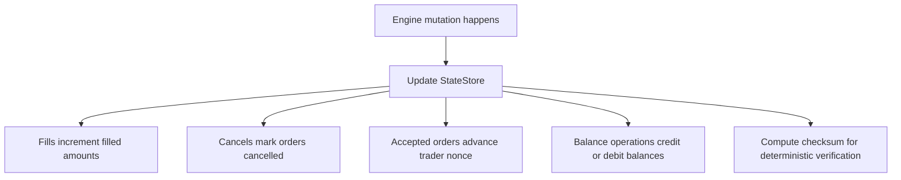

# `src/db/mod.rs` Flow

## Why this file exists

Despite the name, this file is not the Postgres integration layer.

It defines the in-memory `StateStore` used by the engine to track durable-looking trading state that can later map to on-chain state.

## Block flow

## Type / function guide

### `StateStore`

What it does:

- stores:
  - filled amounts
  - cancelled flags
  - highest accepted trader nonce
  - balances

Why we need it:

- this is the in-memory state model that mirrors what may later move on-chain

### `new()`

What it does:

- creates an empty state store

Why we need it:

- engine bootstrap starts from a known empty state

### `apply_fill(...)`

What it does:

- increments filled quantities for taker and maker order hashes

Why we need it:

- fills are the atomic unit of execution state update

### `filled_amount(...)`

What it does:

- returns cumulative filled quantity for an order

Why we need it:

- engine/order status queries need current filled state

### `cancel_order(...)`

What it does:

- marks an order as cancelled

Why we need it:

- cancel state must survive replay/recovery

### `is_cancelled(...)`

What it does:

- checks whether an order has already been cancelled

Why we need it:

- engine intake needs to reject invalid reuse

### `check_and_update_nonce(...)`

What it does:

- enforces strictly increasing nonce per trader

Why we need it:

- replay safety and duplicate/ordering protection

### `last_nonce(...)`

What it does:

- returns most recently accepted nonce

Why we need it:

- observability and validation helpers

### `credit(...)`, `debit(...)`, `balance(...)`

What they do:

- maintain simple per-trader asset balances

Why we need them:

- the engine needs a balance model even before on-chain custody exists

### `checksum()`

What it does:

- computes a deterministic hash of core state fields

Why we need it:

- replayed state should be verifiable and deterministic
