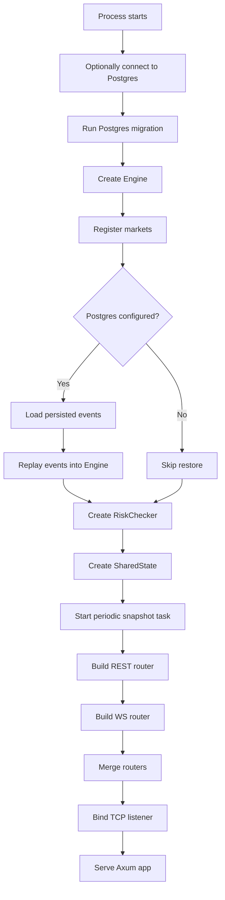

# `src/main.rs` Flow

## Why this file exists

`main.rs` is the process bootstrapper. It wires together persistence, engine state, risk, routers, snapshots, and the HTTP server.

## Block Flow

## Function-by-function

### `main()`

What it does:

- optionally opens Postgres via `PgStore`
- creates and seeds the matching engine
- restores in-memory engine state from persisted events
- creates shared app state used by REST and WebSocket layers
- starts periodic snapshots
- builds the Axum app and starts listening on `0.0.0.0:8080`

Why we need it:

- every other file defines pieces of behavior
- `main()` is where those pieces are assembled into a running service

## Important decisions in this file

- Postgres is optional: no `DATABASE_URL` means the app still runs
- live state is rebuilt into memory on startup
- markets are hardcoded during bootstrap in the current phase
- snapshots are background maintenance, not part of request handling
