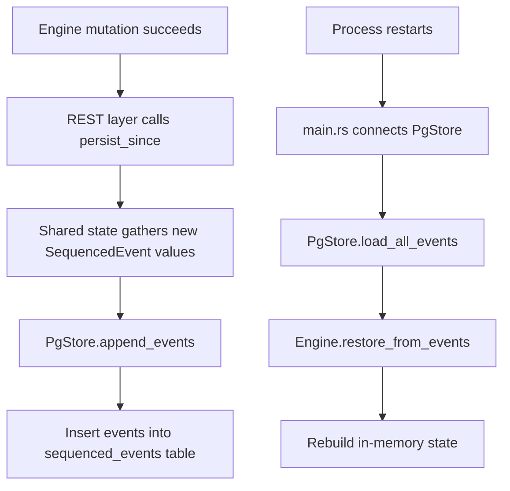
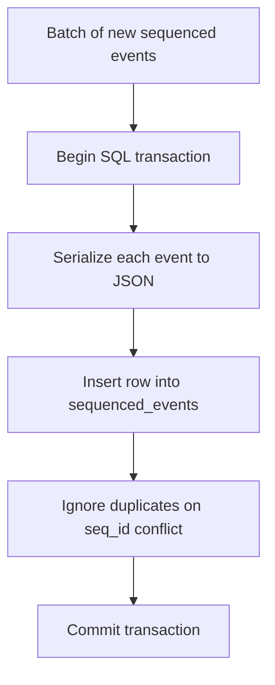
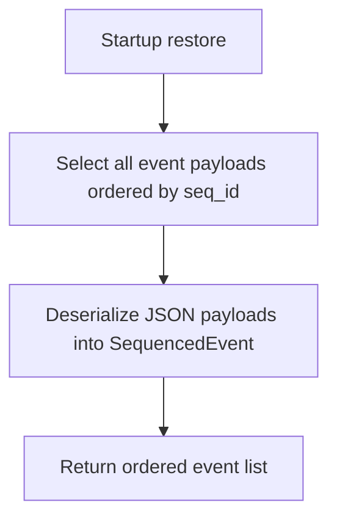

# `src/pg/mod.rs` Flow

## Why this file exists

`pg/mod.rs` is the Postgres-backed event persistence layer.

It is not the live engine state. It is the durable event log used to rebuild in-memory state after restart.

## Block flow

## Type / function guide

### `PgStore`

What it does:

- wraps a Postgres connection pool

Why we need it:

- persistence concerns should stay separate from engine logic

### `connect(database_url)`

What it does:

- opens a Postgres pool

Why we need it:

- bootstrap needs a store object before migrations or reads/writes can happen

### `migrate()`

What it does:

- ensures the `sequenced_events` table exists

Why we need it:

- the service should be able to start cleanly without manual table creation first

### `append_events(events)`

Block flow:

Why we need it:

- durable append-only persistence for crash recovery

### `load_all_events()`

Block flow:

Why we need it:

- engine state is rebuilt by replay, not by reading live mutable rows

### `event_type_tag(event)`

What it does:

- derives a stable string tag for the event type

Why we need it:

- useful metadata for the persisted event rows and operational inspection
