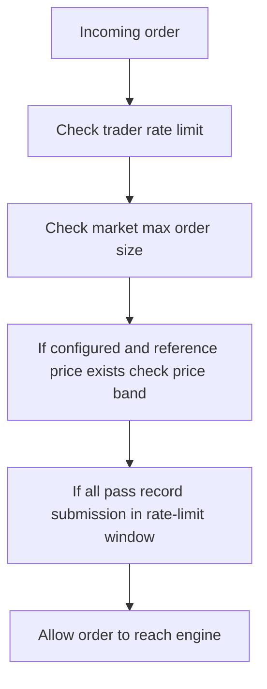
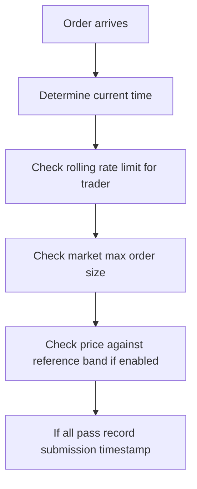

# `src/risk/mod.rs` Flow

## Why this file exists

`risk/mod.rs` is the pre-trade gatekeeper.

It performs fast checks before an order is allowed into the deterministic matching engine.

## Block flow

## Type / function guide

### `MarketRiskConfig`

What it does:

- defines per-market limits such as max order size and price band

Why we need it:

- different markets may need different risk tolerances

### `RiskConfig`

What it does:

- defines global rate-limit settings and per-market overrides

Why we need it:

- risk policy should be configurable, not hardcoded deep in engine logic

### `RiskError`

What it does:

- represents the possible pre-trade risk failures

Why we need it:

- REST layer maps these failures into API responses

### `RiskChecker`

What it does:

- stores rate-limit windows and market reference prices
- exposes a single `check(...)` entrypoint

Why we need it:

- risk is stateful and should live outside the matching engine core

### `update_reference_price(...)`

What it does:

- stores the latest traded price for a market

Why we need it:

- price-band checks need a reference price

### `check(...)`

Block flow:

Why we need it:

- fast reject path for spam, oversized orders, and off-market prices

### `check_rate_limit(...)`

What it does:

- counts recent submissions in the configured rolling window

Why we need it:

- avoid order spam from one trader

### `record_submission(...)`

What it does:

- prunes old timestamps and records the new accepted submission

Why we need it:

- keep rate-limit memory bounded and accurate

### `check_price_band(...)`

What it does:

- rejects orders outside the allowed band around reference price

Why we need it:

- circuit-breaker style protection before sequencing
